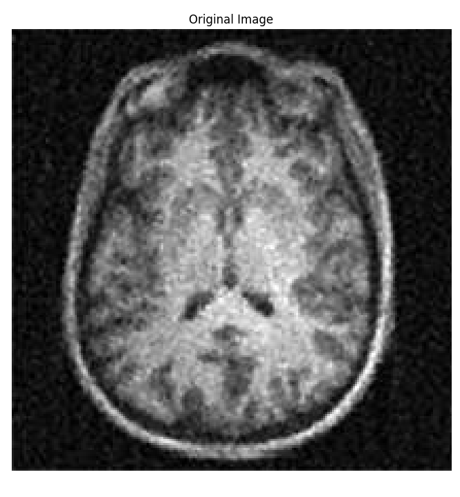

# AN-Augment

**AN-Augment** (**Advanced and Novel Augmentation**) is a Python library designed to provide **cutting-edge** and **innovative** data augmentation techniques across multiple domains. Whether you're working with medical imaging, mechanical simulations, environmental data, or water systems, **AN-Augment** delivers **advanced** and **novel** transformations to enrich dataset diversity and improve the robustness of machine learning and deep learning models.

## Features

- **Multi-Domain Augmentations**:
  - **Medical Imaging**: Elastic deformation, intensity scaling, Gaussian blurring, and more.
  - **Mechanical Simulations**: Structural noise, rotation, scaling, and stress-based transformations.
  - **Environmental Data**: Cloud occlusion, noise addition, and spatial scaling.
  - **Water Systems**: Wave simulation, flow distortion, and scaling factors.
- **Fine-Grained Control**: Adjustable parameters for precise transformation intensity and probability.
- **Batch Processing & Randomization**: Apply augmentations to image/data batches with flexible randomization settings.
- **Visualization Tools**: Easily visualize original and augmented data side-by-side for quick quality checks.

## Installation

To install **AN-Augment**, clone the repository and install the requirements:

```bash
git clone https://github.com/yourusername/an-augment.git
cd an-augment
pip install -r requirements.txt
```

## Usage

Here’s a quick example of how to use **AN-Augment** for medical imaging augmentations:

```python
import cv2
import matplotlib.pyplot as plt
from an_augment.medical_augmentation import MedicalAugmentation

# Load the image
image = cv2.imread("images/mri.jpg", cv2.IMREAD_GRAYSCALE) / 255.0

# Initialize the augmentor
augmentor = MedicalAugmentation()

# Define augmentation parameters
params = {
    'elastic_deformation': {'alpha': 30, 'sigma': 4},
    'intensity_scaling': {'brightness_factor': 1.2, 'contrast_factor': 1.3},
    'gaussian_blur': {'blur_radius': 2},
    'random_rotation': {'angle_range': (-15, 15)},
    'flip': {'flip_horizontal': True, 'flip_vertical': False},
    'random_crop_and_scale': {'crop_size': (0.8, 0.8), 'scaling_factor': 1.0},
    'add_noise': {'noise_type': 'gaussian', 'noise_intensity': 0.05},
    'occlusion': {'mask_shape': 'rectangle', 'mask_size_range': (0.1, 0.2)}
}

# Apply augmentations
augmented_image = augmentor.apply_augmentations(image, **params)

# Display original and augmented images
plt.figure(figsize=(12, 6))
plt.subplot(1, 2, 1)
plt.title("Original Image")
plt.imshow(image, cmap="gray")
plt.axis("off")

plt.subplot(1, 2, 2)
plt.title("Augmented Image")
plt.imshow(augmented_image, cmap="gray")
plt.axis("off")

plt.tight_layout()
plt.show()
```

Here is an example of the original image and the augmented result:

| Original Image                     | Augmented Image                     |
|------------------------------------|-------------------------------------|
|   |  |

For other domains (e.g., mechanical or environmental), the process is similar—just import the relevant augmentation module (e.g., `MechanicalAugmentation`, `EnvironmentalAugmentation`, etc.).

## Augmentations

### Medical Imaging

- **Elastic Deformation**: Adds tissue-like distortions with controlled intensity.
- **Intensity Scaling**: Simulates variations in brightness and contrast.
- **Gaussian Blur**: Mimics lower-resolution scanner settings.
- **Random Rotation**: Applies small random rotations, helpful for MRI/CT.
- **Flipping**: Horizontal/vertical flips, useful for symmetrical structures.
- **Occlusion**: Adds random occlusions to simulate partial visibility.

### Mechanical Simulations

- **Structural Noise**: Simulates material wear and stress.
- **Random Rotation**: Applies angular distortions to components.
- **Scaling**: Simulates manufacturing variations in component dimensions.

### Environmental Data

- **Cloud Occlusion**: Simulates weather effects obscuring satellite imagery.
- **Spatial Scaling**: Adjusts resolution for remote sensing data.
- **Random Noise**: Adds Gaussian or uniform noise for simulation.

### Water Systems

- **Wave Simulation**: Simulates ripples and wave motion.
- **Flow Distortion**: Creates realistic variations in flow dynamics.
- **Scaling Factors**: Models changes in water levels or velocity.

## Contributing

We welcome contributions! Fork the repository, make your changes, and submit a pull request. You can contribute new augmentation types or improve existing ones.

## License

**AN-Augment** is licensed under the Apache-2.0 License.
